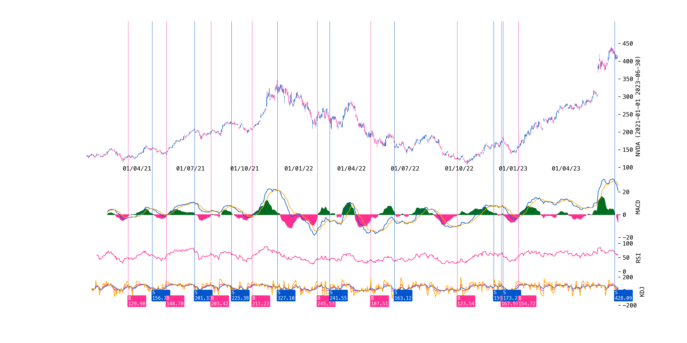
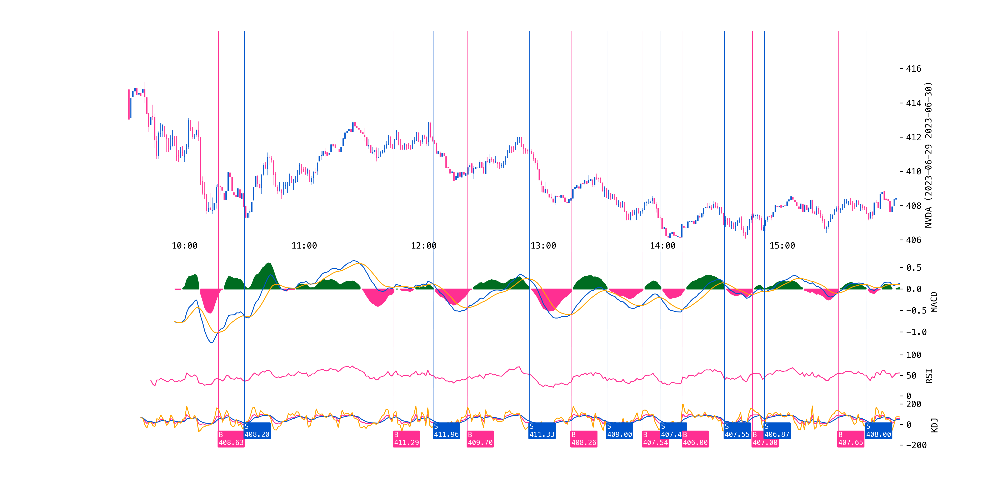

# Stock Plotter

This is a Python script that uses matplotlib and yfinance to plot stock data with various indicators, such as MACD, KDJ, and RSI. It can plot both daily and minute data for any ticker symbol.

## Requirements

- Python 3.6 or higher
- matplotlib
- yfinance
- pandas
- numpy

## Usage

There are two main functions in this script: `plotOneDay` and `plotOneMinute`. They both take three arguments: `ticker`, `startTime`, and `endTime`.

- `ticker` is the stock symbol to plot, such as "AAPL" or "TSLA".
- `startTime` and `endTime` are the start and end dates of the data to plot, in the format of "YYYY-MM-DD". For minute data, they also include the time in the format of "HH:MM".

For example, to plot the daily data of Apple from January 1, 2020 to December 31, 2020, you can call:

```python
plotOneDay("NVDA", "2020-01-01", "2023-06-30")
```

To plot the minute data of Tesla from 9:30 AM to 4:00 PM on June 27, 2023, you can call:

```python
plotOneMinute("NVDA", "2023-06-27", "2023-06-28")
plotOneMinute("0700.hk", "2023-06-27", "2023-06-28")
```

The functions will download the data using yfinance, calculate the indicators, and plot them using matplotlib. They will also save the figure as a PNG file in the current directory, with the name format of "{interval} {ticker} {startTime} {endTime}.png".

The functions will also return a pandas DataFrame with the original data and the calculated indicators.

## Output

Here are some sample outputs generated by the script:





## License

This project is licensed under the MIT License - see the [LICENSE](LICENSE) file for details.
```
```